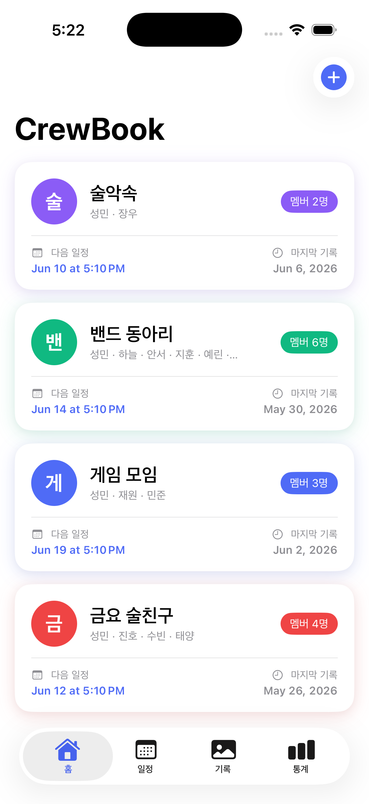
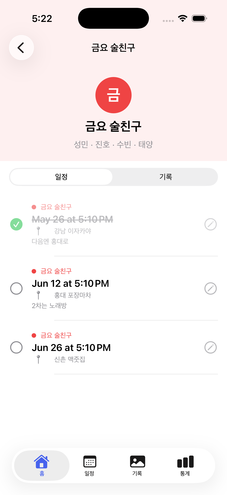
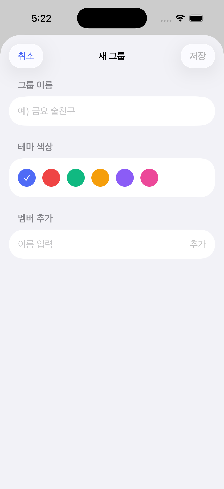
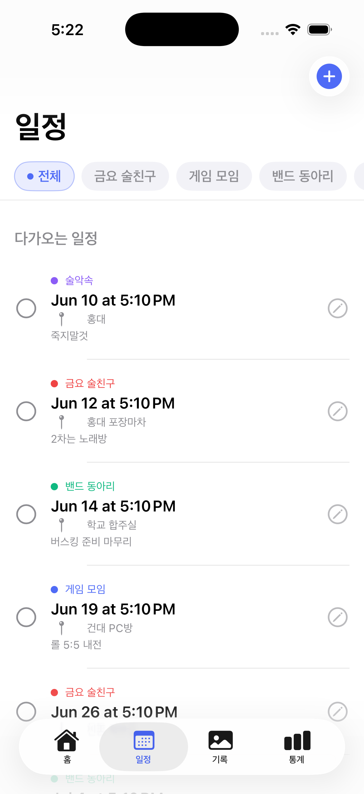
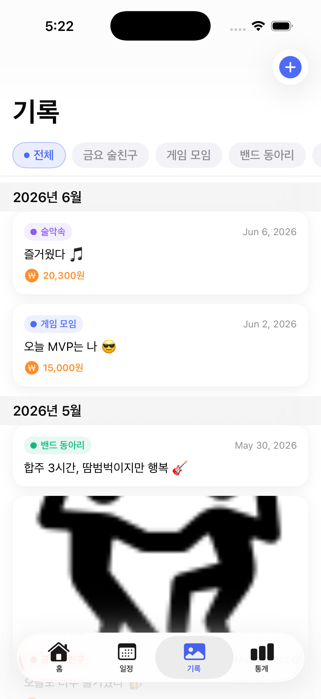
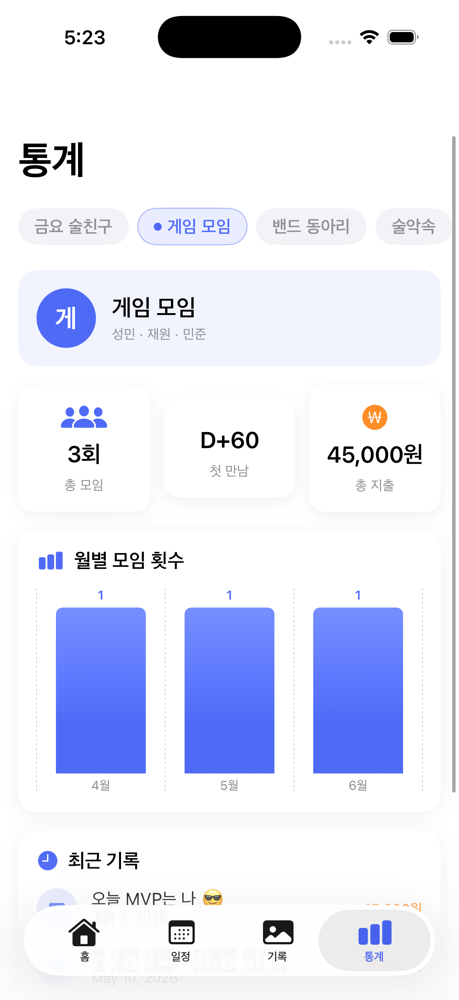

# CrewBook 🗓️
> 모임을 기록하는 가장 감성적인 방법

[](https://swift.org)
[](https://developer.apple.com/ios/)
[](https://developer.apple.com/xcode/)
[](https://developer.apple.com/xcode/swiftui/)
[](https://developer.apple.com/xcode/swiftdata/)

<br/>

## 📱 소개 영상

[](https://youtube.com)

> 영상 링크는 업로드 후 위 배지를 수정해주세요.

<br/>

## 💡 기획 배경

20대 대학생들은 동아리, 과 친구, 술자리 등 다양한 모임을 자주 가집니다.  
하지만 모임과 관련된 약속 날짜, 지출 내역, 추억 사진이 **카카오톡 단체 채팅방에 분산**되어 관리가 어렵습니다.

| 문제 | 설명 |
|---|---|
| 📱 모임 약속 | 단톡방에서 날짜를 찾으려면 스크롤을 한참 올려야 함 |
| 💸 지출 기억 | 정산 이후 얼마를 냈는지 기억이 안 남 |
| 📸 추억 관리 | 사진이 개인 앨범에 분산되어 모임별 정리 불가 |
| 📊 관계 유지 | 마지막으로 만난 날이 언제인지 알 수 없음 |

**CrewBook**은 이 모든 불편함을 하나의 앱에서 해결합니다.

<br/>

## 📸 스크린샷

| 홈 | 그룹 상세 | 그룹 추가 |
|:---:|:---:|:---:|
|  |  |  |

| 일정 | 기록 | 통계 |
|:---:|:---:|:---:|
|  |  |  |

<br/>

## ✨ 주요 기능

### 🏠 홈 — 그룹 관리
- 친구 모임을 그룹으로 생성 (이름, 멤버, 테마 색상)
- 그룹 카드에서 다음 일정, 마지막 기록 날짜 한눈에 확인
- 그룹 탭하면 해당 그룹의 일정/기록 상세 조회
- 꾹 누르면 수정 / 삭제

### 📅 일정 — 모임 약속 관리
- 날짜, 장소, 메모와 함께 일정 등록
- 다가오는 일정 / 지난 일정 자동 분류
- 그룹별 필터로 원하는 모임 일정만 조회
- 완료 체크 시 취소선 처리 및 지난 일정으로 이동

### 📸 기록 — 추억 보관
- 사진 + 한줄 코멘트 + 지출 금액 기록
- 월별 타임라인 형식으로 모아보기
- 그룹별 필터로 원하는 모임 기록만 조회
- 꾹 누르면 수정 / 삭제

### 📊 통계 — 모임 분석
- 총 모임 횟수, 첫 만남 D+day, 총 지출 금액
- 월별 모임 빈도 막대 차트
- 최근 기록 3개 미리보기
- 그룹별 필터로 전환

<br/>

## 🛠 기술 스택

| 분류 | 기술 |
|---|---|
| UI | SwiftUI |
| 데이터 | SwiftData |
| 사진 | PhotosUI |
| 차트 | Swift Charts |
| 아이콘 | SF Symbols |
| 개발 환경 | Xcode 15+, iOS 17+ |

<br/>

## 🗂 프로젝트 구조

```
CrewBook/
├── App/
│   ├── CrewBookApp.swift       # 앱 진입점, SwiftData 컨테이너
│   └── SampleData.swift        # 샘플 데이터
├── Models/
│   ├── Group.swift             # 그룹 데이터 모델
│   ├── Schedule.swift          # 일정 데이터 모델
│   └── Memory.swift            # 기록 데이터 모델
├── Views/
│   ├── Home/                   # 홈 탭
│   │   ├── HomeView.swift
│   │   ├── GroupDetailView.swift
│   │   ├── AddGroupView.swift
│   │   └── EditGroupView.swift
│   ├── Schedule/               # 일정 탭
│   │   ├── ScheduleView.swift
│   │   ├── AddScheduleView.swift
│   │   └── EditScheduleView.swift
│   ├── Memory/                 # 기록 탭
│   │   ├── MemoryView.swift
│   │   ├── AddMemoryView.swift
│   │   └── EditMemoryView.swift
│   └── Stats/                  # 통계 탭
│       └── StatsView.swift
└── Components/                 # 재사용 컴포넌트
    ├── GroupCardView.swift
    ├── GroupDetailView.swift
    ├── ScheduleRowView.swift
    ├── MemoryCardView.swift
    ├── FilterChip.swift
    ├── ToastView.swift
    ├── HapticManager.swift
    └── Color+Hex.swift
```

<br/>

## 🚀 실행 방법

1. 레포지토리 클론
```bash
git clone https://github.com/SeongminJang312/CrewBook.git
```

2. Xcode에서 `CrewBook.xcodeproj` 열기

3. 시뮬레이터 또는 실제 기기에서 실행 (iOS 17.0 이상)

> 별도의 외부 라이브러리 설치 없이 바로 실행 가능합니다.

<br/>

## 👨‍💻 개발자

| 이름 | 학번 | 과목 |
|---|---|---|
| 장성민 | 2371063 | 모바일 앱 개발 |

<br/>

---

> 본 프로젝트는 한성대학교 모바일 앱 개발 수업 미니 프로젝트로 제작되었습니다.
